# 船新版本阿孝 · Personal Blog

<div align="center">

[](https://ayon1997.github.io/axiao-blog/)
[](https://github.com/ayon1997/axiao-blog/actions)
[](LICENSE)

**一个支持多分支独立部署的 GitHub Pages 静态资源服务器**

[📚 部署指南](#-快速部署) • [🌐 在线访问](https://ayon1997.github.io/axiao-blog/) • [📖 文档](#-相关文档)

</div>

---

## 📖 项目简介

这是一个基于 GitHub Pages 的 CDN 静态资源服务器，支持多分支独立部署到不同路径，适用于多环境开发、测试和生产场景。

### 核心特性

- ✅ **多分支部署** - 每个分支自动部署到独立路径
- ✅ **自动化 CI/CD** - GitHub Actions 全自动构建和部署
- ✅ **环境隔离** - 开发、测试、生产环境完全分离
- ✅ **零成本托管** - 基于 GitHub Pages 免费服务
- ✅ **CDN 加速** - GitHub 全球 CDN 网络加速访问

## 🌐 在线访问地址

| 分支 | 环境 | 访问地址 | 状态 |
|------|------|----------|------|
| **main** | 生产环境 | [https://ayon1997.github.io/axiao-blog/](https://ayon1997.github.io/axiao-blog/) | ✅ 运行中 |
| **dev** | 开发环境 | [https://ayon1997.github.io/dev/axiao-blog/](https://ayon1997.github.io/dev/axiao-blog/) | ✅ 运行中 |
| **dev2** | 测试环境 | [https://ayon1997.github.io/dev2/axiao-blog/](https://ayon1997.github.io/dev2/axiao-blog/) | ✅ 运行中 |
| **staging** | 预发布 | [https://ayon1997.github.io/staging/axiao-blog/](https://ayon1997.github.io/staging/axiao-blog/) | ⏸️ 待配置 |

## 🚀 快速部署

### 1. Fork 本项目

点击右上角的 **Fork** 按钮，将项目复制到你的账户下。

### 2. 配置 GitHub Pages

进入仓库 **Settings** → **Pages**：
- Source: `Deploy from a branch`
- Branch: `gh-pages`
- Folder: `/ (root)`

### 3. 配置 Actions 权限

进入 **Settings** → **Actions** → **General**：
- Workflow permissions: ✅ `Read and write permissions`
- ✅ Allow GitHub Actions to create and approve pull requests

详细配置请参考 [权限配置指南.md](./权限配置指南.md)

### 4. 推送代码触发部署

```bash
git push origin main
```

等待 GitHub Actions 完成部署，即可访问你的 CDN 服务器！

## 📁 项目结构

```
axiao-blog/
├── .github/
│   └── workflows/
│       └── deploy.yaml          # GitHub Actions 部署配置
├── src/                         # 源代码目录
├── dist/                        # 构建输出目录
├── README.md                    # 项目说明
├── 权限配置指南.md              # GitHub Actions 权限配置
├── 多分支部署指南.md            # 多分支部署详细说明
├── DEPLOYMENT-GUIDE.md          # 部署指南
└── package.json                 # 项目配置
```

## 🛠️ 本地开发

### 安装依赖

```bash
npm install
```

### 本地预览

```bash
# 开发模式
npm run dev

# 构建项目
npm run build

# 预览构建结果
npm run preview
```

## 📚 相关文档

- [📋 权限配置指南](./权限配置指南.md) - GitHub Actions 权限配置详解
- [🌿 多分支部署指南](./多分支部署指南.md) - 多分支部署实现原理
- [🚀 DEPLOYMENT-GUIDE](./DEPLOYMENT-GUIDE.md) - 完整部署流程

## 🔧 工作原理

1. **推送代码** → 触发 GitHub Actions
2. **自动构建** → 根据分支执行构建脚本
3. **部署到 gh-pages** → 部署到对应子目录
4. **访问网站** → 通过 GitHub Pages 访问

```mermaid
graph LR
    A[推送代码] --> B[GitHub Actions]
    B --> C[构建项目]
    C --> D[部署到 gh-pages]
    D --> E[GitHub Pages 发布]
    E --> F[访问网站]
```



## 🤝 贡献指南

欢迎提交 Issue 和 Pull Request！

1. Fork 本项目
2. 创建特性分支 (`git checkout -b feature/AmazingFeature`)
3. 提交改动 (`git commit -m 'Add some AmazingFeature'`)
4. 推送到分支 (`git push origin feature/AmazingFeature`)
5. 开启 Pull Request

## 📝 许可证

本项目采用 ISC 许可证 - 详见 [LICENSE](LICENSE) 文件

## 💡 常见问题

<details>
<summary><b>如何添加新的部署分支？</b></summary>

参考 [多分支部署指南.md](./多分支部署指南.md) 中的"添加新分支"章节。
</details>

<details>
<summary><b>部署失败怎么办？</b></summary>

请查看 [权限配置指南.md](./权限配置指南.md) 中的故障排除部分。
</details>

<details>
<summary><b>如何自定义域名？</b></summary>

在 GitHub Pages 设置中配置自定义域名，并在项目根目录添加 `CNAME` 文件。
</details>

## 📮 联系方式

- **作者**: 船新版本阿孝
- **GitHub**: [@aYon1997](https://github.com/aYon1997)
- **项目地址**: [axiao-blog](https://github.com/aYon1997/axiao-blog)

---

<div align="center">

**⭐ 如果这个项目对你有帮助，请给一个 Star ⭐**

Made with ❤️ by 船新版本阿孝

</div>