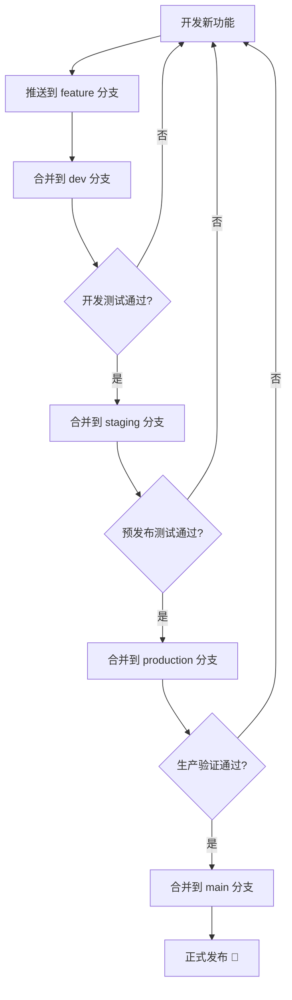

# 🌿 多分支 GitHub Pages 部署指南

<div align="center">

**实现不同分支自动部署到不同路径的完整方案**

[](https://pages.github.com/)
[]()

[🎯 部署架构](#-部署架构) • [🚀 快速开始](#-快速开始) • [💡 最佳实践](#-最佳实践)

</div>

---

## 📖 概述

本项目实现了根据不同分支自动部署到不同路径的 GitHub Pages 功能。每个分支都有：

- ✅ 独立的访问地址
- ✅ 独特的页面内容
- ✅ 自动化的部署流程
- ✅ 完全隔离的运行环境

## 分支部署映射

| 分支名称 | 部署地址 | 页面特色 | 用途 |
|---------|----------|----------|------|
| `main` | https://ayon1997.github.io/CDN-server/ | 蓝色主题，生产环境 | 正式发布版本 |
| `dev` | https://ayon1997.github.io/dev/CDN-server/ | 橙色主题，开发环境横幅 | 开发测试 |
| `dev2` | https://ayon1997.github.io/dev2/CDN-server/ | 紫色主题，实验性功能 | 实验性功能测试 |
| `staging` | https://ayon1997.github.io/staging/CDN-server/ | 黄色主题，预发布环境 | 预发布测试 |
| `production` | https://ayon1997.github.io/production/CDN-server/ | 绿色主题，生产环境 | 生产环境 |

## 快速开始

### 1. 创建分支

```bash
# 创建dev2分支
git checkout -b dev2

# 推送到远程仓库
git push -u origin dev2
```

### 2. 自动部署

当您向任何配置的分支推送代码时，GitHub Action会自动触发部署：

```bash
# 在dev2分支上进行修改
echo "更新内容" >> index-dev2.html
git add .
git commit -m "更新dev2环境内容"
git push origin dev2
```

### 3. 查看部署结果

部署完成后，您可以通过以下地址访问：
- https://ayon1997.github.io/dev2/CDN-server/

## 本地开发

### 安装依赖

```bash
npm install
```

### 本地预览

```bash
# 预览主页面
npm run serve

# 预览dev环境
npm run serve:dev

# 预览dev2环境
npm run serve:dev2

# 预览staging环境
npm run serve:staging
```

## 自定义分支配置

### 添加新分支

1. **创建HTML文件**：为新分支创建专用的HTML文件
   ```bash
   cp index-dev.html index-新分支名.html
   ```

2. **修改GitHub Action**：在`.github/workflows/deploy.yaml`中添加新的job
   ```yaml
   deploy-新分支名:
     if: github.ref == 'refs/heads/新分支名'
     runs-on: ubuntu-latest
     steps:
       # ... 类似其他分支的配置
   ```

3. **更新package.json**：添加构建和服务脚本
   ```json
   {
     "scripts": {
       "build:新分支名": "cross-env NODE_ENV=development BRANCH=新分支名 npm run build",
       "serve:新分支名": "npx http-server . -p 端口号 -o /index-新分支名.html"
     }
   }
   ```

### 分支特定的样式主题

每个分支都有独特的视觉标识：

- **Main**: 默认蓝色主题
- **Dev**: 橙色主题 + 开发环境横幅
- **Dev2**: 紫色主题 + 实验性功能标识
- **Staging**: 黄色主题 + 预发布环境标识
- **Production**: 绿色主题 + 生产环境标识

## 工作流程说明

### 自动部署流程

1. **触发条件**：推送到指定分支
2. **环境检测**：GitHub Action识别分支名称
3. **构建过程**：
   - 安装依赖
   - 执行分支特定的构建脚本
   - 复制对应的HTML文件到dist目录
4. **部署过程**：
   - 使用`peaceiris/actions-gh-pages@v3`
   - 部署到`gh-pages`分支的对应子目录
   - 保持其他分支的内容不变

### 分支隔离机制

- 每个分支部署到独立的子目录
- 分支间内容完全隔离
- 可以同时访问所有环境
- 支持独立的配置和样式

## 高级配置

### 环境变量

在GitHub Action中可以使用以下环境变量：

- `NODE_ENV`: 环境类型 (development/staging/production)
- `BRANCH_NAME`: 当前分支名称
- `GITHUB_TOKEN`: GitHub访问令牌 (自动提供)

### 自定义域名

如果您有自定义域名，可以在GitHub Action中设置：

```yaml
- name: Deploy to GitHub Pages
  uses: peaceiris/actions-gh-pages@v3
  with:
    github_token: ${{ secrets.GITHUB_TOKEN }}
    publish_dir: ./dist
    publish_branch: gh-pages
    cname: your-custom-domain.com  # 自定义域名
```

### 构建优化

对于复杂项目，可以添加更多构建步骤：

```yaml
- name: Build project
  run: |
    # 安装依赖
    npm ci
    
    # 运行测试
    npm test
    
    # 构建项目
    npm run build:${{ env.BRANCH_NAME }}
    
    # 优化资源
    npm run optimize
```

## 故障排除

### 常见问题

1. **部署失败**：检查GitHub Action日志
2. **页面不显示**：确认GitHub Pages设置正确
3. **样式错误**：检查HTML文件中的CSS路径
4. **分支不触发**：确认分支名在`deploy.yaml`的触发条件中

### 调试方法

```bash
# 本地测试构建
npm run build:dev2

# 检查生成的文件
ls -la dist/

# 本地预览
npm run serve:dev2
```

## 最佳实践

1. **分支命名**：使用清晰的分支命名规范
2. **内容差异化**：为每个环境提供明确的视觉标识
3. **定期清理**：删除不再需要的分支和对应配置
4. **文档更新**：及时更新部署地址和说明

## 示例工作流

### 开发新功能

```bash
# 1. 创建feature分支
git checkout -b feature/new-feature

# 2. 开发和测试
# ... 代码修改 ...

# 3. 合并到dev分支测试
git checkout dev
git merge feature/new-feature
git push origin dev

# 4. 在dev2分支进行实验性测试
git checkout dev2
git cherry-pick <commit-hash>
git push origin dev2

# 5. 测试通过后合并到main
git checkout main
git merge dev
git push origin main
```

这样，您就可以在不同的环境中并行测试同一功能的不同版本了！

## 📊 部署流程图



## 🎨 环境主题配色

| 环境 | 主色调 | 用途 |
|------|--------|------|
| Main | 🔵 蓝色 `#3498db` | 生产环境，稳定可靠 |
| Dev | 🟠 橙色 `#e67e22` | 开发环境，快速迭代 |
| Dev2 | 🟣 紫色 `#9b59b6` | 实验环境，新功能测试 |
| Staging | 🟡 黄色 `#f39c12` | 预发布，最终验证 |
| Production | 🟢 绿色 `#27ae60` | 生产就绪，随时上线 |

## 🔗 相关资源

- [GitHub Actions 文档](https://docs.github.com/en/actions)
- [GitHub Pages 文档](https://docs.github.com/en/pages)
- [peaceiris/actions-gh-pages](https://github.com/peaceiris/actions-gh-pages)

---

<div align="center">

**🎉 现在你已经掌握了多分支部署的所有技巧！**

[⬆️ 返回顶部](#-多分支-github-pages-部署指南) • [📖 返回主文档](./README.md)

Made with ❤️ by 船新版本阿孝

</div> 